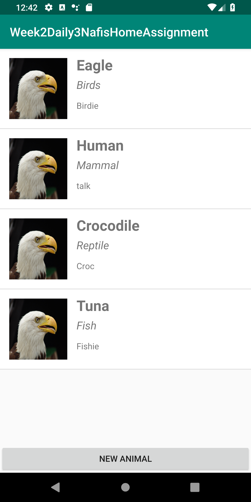
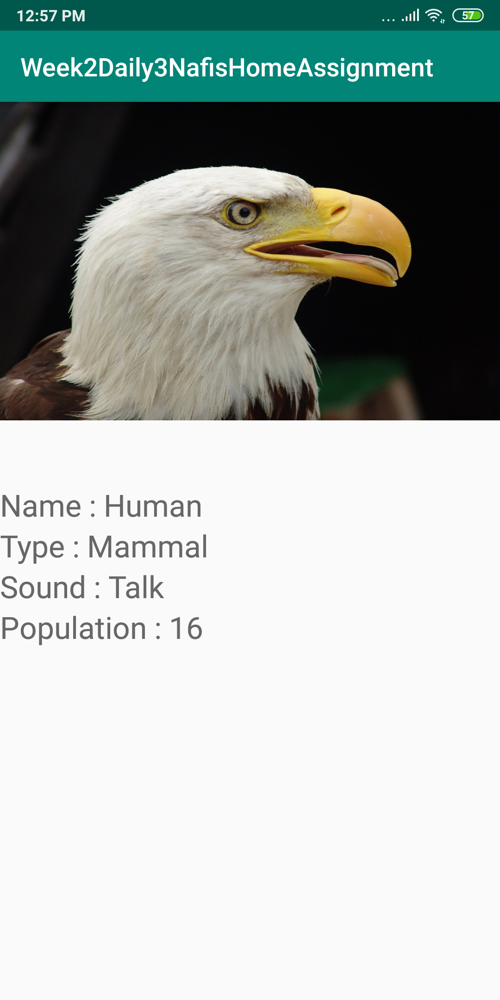
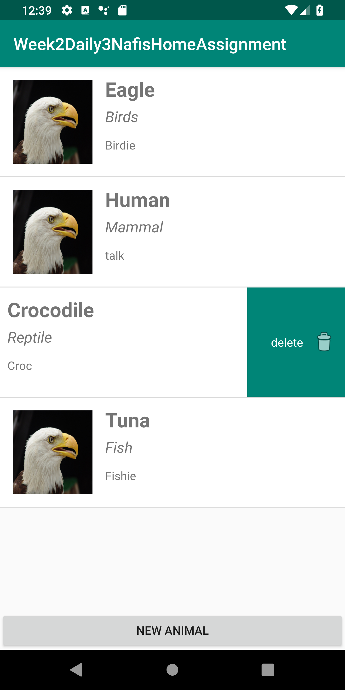
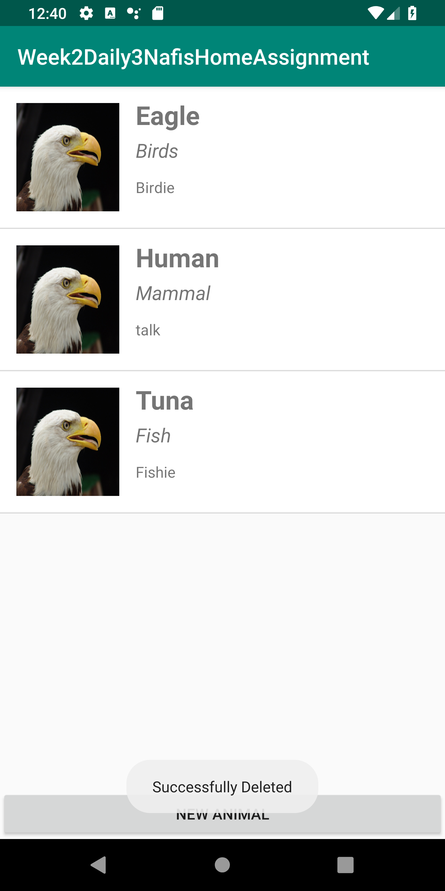

# Week2Daily3NafisHomeAssignment
Week 2 daily 3 Home Assignment on RecycleView, database, ListView, ItemTouchHelper.

RecycleView showing all data in database.

Clicking an item will show item details.

Added successfully a new animal in database.

Swapping to delete the item no. 3 from recyclerview.

Deleted successfully.

